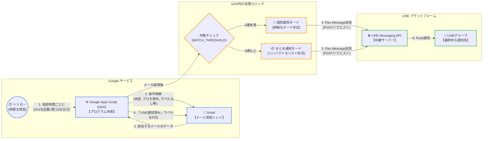

# Gmail to LINE ハイブリッド通知 Bot (GAS)

Gmailに届いた新着メールを、LINE Messaging APIを使用してLINEグループへ自動通知するGoogle Apps Script (GAS) プログラムです。

## 🌟 主な機能

- **ハイブリッド通知モード**:
  - 新着メールが少ない時（例：3通未満）は、本文まで詳しく読める「個別カード形式」で通知。
  - 新着メールが多い時（例：3通以上）は、トーク画面を占有しないよう「まとめリスト形式」で通知。
- **インテリジェントな未読管理**:
  - Gmail上のメールを「既読」にせず、**未読のまま**管理します。
  - 「LINE通知済み」ラベルを自動付与することで、重複通知を防止。
  - ラベルが付いているスレッドでも、新しい返信（未読）が来れば再度通知されます。
- **強力なフィルタリング**:
  - プロモーション（広告）メールの除外。
  - 自分自身が送信したメールの除外。
  - メール不達通知（Mailer-Daemon）の除外。
- **API消費量の節約**:
  - LINE Messaging APIの無料枠（月200通）を考慮し、まとめ通知機能で送信回数を最小限に抑えます。

## 📋 事前準備

1. **LINE Developers**:
   - Messaging APIチャネルを作成し、「チャネルアクセストークン」を取得。
   - 通知先の「グループID」または「ユーザーID」を取得。
2. **Google Apps Script**:
   - GoogleアカウントでGASプロジェクトを作成。

## 🚀 セットアップ手順

1. **スクリプトの貼り付け**:
   - `コード.gs`（提供されたコード）をGASエディタに貼り付けます。
2. **設定値の入力**:
   - スクリプト上部の `LINE_TOKEN` と `TO_ID` をご自身のものに書き換えます。
   - 必要に応じて `BATCH_THRESHOLD`（まとめ通知に切り替える通数）を調整します。
3. **権限の承認**:
   - GAS上で「実行」を一度行い、Gmailへのアクセスと外部サービスへの接続を許可します。
4. **トリガーの設定**:
   - GASのトリガー設定（時計アイコン）から、`fetchAndNotify` 関数を「時間主導型」で設定します。
   - API制限を考慮し、**「15分おき」〜「30分おき」**程度の実行を推奨します。

## 🛠 カスタマイズ

### 通知条件の変更
`query` 変数を書き換えることで、通知するメールを絞り込めます。
```javascript
// 例：重要マークがついているものだけ通知する場合
const query = 'is:unread in:inbox is:important ...';
```
### 本文の文字数
個別通知の本文文字数や、まとめ通知の文字数はスクリプト内の `substring` メソッドの引数で変更可能です。

## ⚠️ 注意事項
- LINE API制限:

  - LINE Messaging APIの無料プランは月間200通までです。5分おきなどの高頻度なトリガー設定は、メール受信数が多い場合に上限に達する可能性があるため注意してください。

- ラベルの削除:

  - Gmail側で「LINE通知済み」ラベルを削除すると、そのスレッドが未読である限り再度通知が送られます。

## システム構成

## 📝 ライセンス
MIT License
